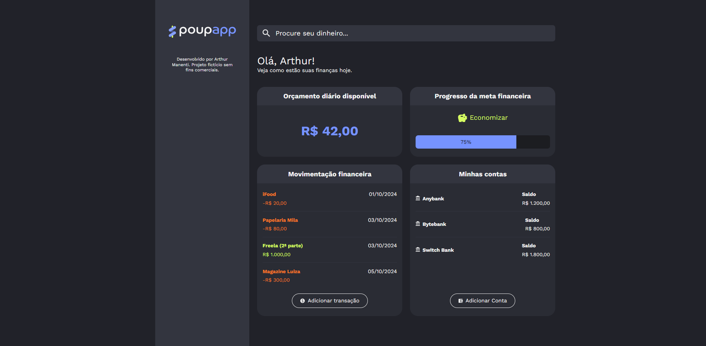

# PoupApp

PoupApp is a personal finance dashboard built with **React + Vite** and designed as a study project for UI styling techniques.

The purpose of this repository is not to deliver a fully functional finance app. Its real goal is to practice layout composition, visual organization and styling strategies, comparing two approaches across separate branches: one using **CSS Modules** and another using **Tailwind CSS**.

This project is intentionally focused on the interface layer, so the emphasis is on component structure, scoped styles and visual experimentation rather than on backend integration, data persistence or business logic.



## Quick Start

Requirements:

- Node.js 18+ recommended

Install dependencies and run the development server:

```bash
npm install
npm run dev
```

Build for production:

```bash
npm run build
npm run preview
```

Run lint verification:

```bash
npm run lint
```

## Main Features

- Personal finance dashboard interface
- Bank account overview
- Transaction list and transaction management UI
- Savings status with progress indicator
- Daily budget section
- Financial health indicators
- Quick transaction search
- Reusable React components
- Modular component structure, including `Accounts`, `Transactions`, `DailyBudget`, `SavingsStatus`, `ProgressBar`, and others
- Styling experiments with separate implementations for CSS Modules and Tailwind CSS

## Branches

- `main` or CSS Modules branch: implementation focused on component-scoped styles
- Tailwind CSS branch: implementation focused on utility-first styling and layout experiments

## Project Purpose

This project was developed as a learning exercise during my studies in front-end styling.

Although PoupApp looks like a personal finance application, it is not meant to be a complete production-ready finance tool. Instead, it was created to practice:

- Building interfaces with React
- Using CSS Modules for scoped component styling
- Using Tailwind CSS for utility-first styling
- Creating reusable components
- Organizing styles by component
- Structuring a front-end project with Vite
- Designing a simple and clean dashboard UI
- Improving component-based development workflow

## Running Locally

1. Clone the repository
2. Install the dependencies:

```bash
npm install
```

3. Start the development server:

```bash
npm run dev
```

## API / Backend

This project is currently a front-end application only.

There is no backend or database integration at the moment. The current focus is on the interface, layout, component structure and scoped styling. If an API is added in the future, the required environment variables, endpoints and setup instructions should be documented here.

## How It Works

PoupApp is a Single Page Application built with React and bundled with Vite for a fast development experience.

The `src` folder contains components organized by responsibility, such as accounts, transactions, daily budget and savings progress. Depending on the branch, the project uses either CSS Modules or Tailwind CSS to compare styling approaches and reinforce learning.

## Repository Structure

- `src/` — React source code, components and CSS Module files
- `public/` — static assets
- `index.html` — main HTML file
- `vite.config.js` — Vite configuration
- `package.json` — project dependencies and scripts

## Credits

Developed by Arthur Lima Manenti
